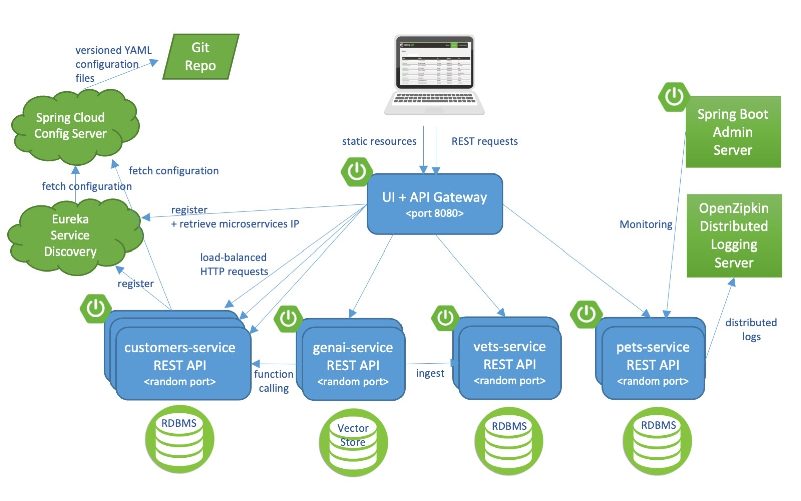

# Vet Microservices — Distributed Spring PetClinic

[](https://opensource.org/licenses/Apache-2.0)

A **veterinary clinic** sample built as **microservices**, derived from [Spring PetClinic Microservices](https://github.com/spring-petclinic/spring-petclinic-microservices) (Spring Cloud Gateway, Eureka, Config Server, Resilience4j, OpenTelemetry) and extended with **Vet-AI** (FastAPI), MLflow, and Grafana/Prometheus.

**Table of contents**

1. [Introduction](#1-introduction)
2. [System architecture](#2-system-architecture)
3. [Related repositories](#3-related-repositories)
4. [Prerequisites](#4-prerequisites)
5. [Clone and directory layout](#5-clone-and-directory-layout)
6. [Build](#6-build)
7. [Configuration](#7-configuration)
8. [Running the system](#8-running-the-system)
9. [Service URLs after startup](#9-service-urls-after-startup)
10. [API and documentation](#10-api-and-documentation)
11. [Microservices overview](#11-microservices-overview)
12. [Integration](#12-integration)
13. [Testing](#13-testing)
14. [Troubleshooting](#14-troubleshooting)
15. [Contributing and license](#15-contributing-and-license)

---

## 1. Introduction

### 1.1 Overview

The system consists of independent Spring Boot services registered with **Eureka**, configured centrally via **Spring Cloud Config**, and accessed through the **API Gateway**. Domain flows cover owners, pets, vets, and visits. **AI for diagnosis and training is provided by [Vet-AI](#32-ai-service-repository)** (FastAPI). The `genai-service` module can also host the upstream Spring AI **chat** feature, which is optional and separate from Vet-AI.

### 1.2 Features

| Area | Description |
|------|-------------|
| Domain | Owner/pet (Customers), vets (Vets), visits (Visits) |
| Cloud stack | Config Server, Discovery (Eureka), API Gateway, circuit breaker |
| Observability | Micrometer, Prometheus, Grafana, Zipkin (tracing) |
| AI / ML | **Vet-AI** (FastAPI: `/predict`, continuous training, MLflow). Optional Spring AI **chat** (OpenAI/Azure) only if you use that upstream feature |

### 1.3 Technology stack

- **Java 17**, Spring Boot 3.x, Spring Cloud
- **Docker / Podman** (images built with Maven profile `buildDocker`)
- **HSQLDB** (default in Compose for customers-service) or **MySQL** (`mysql` profile; see [Integration](#12-integration))

---

## 2. System architecture

### 2.1 Architecture diagram



### 2.2 Components

- **API Gateway**: single entry for the UI (AngularJS bundled in the gateway) and REST routing.
- **Discovery Server**: service registry and discovery.
- **Config Server**: configuration from Git ([vet-microservices-config](#31-config-repository)).
- **Customers / Vets / Visits**: domain services.
- **GenAI Service** (optional in Compose): BFF for **Vet-AI** (diagnosis, feedback, training APIs); may also wire optional upstream **LLM chat** if configured.
- **Vet-AI, MLflow, Postgres**: ML stack (see `docker-compose.yml`).

### 2.3 Communication

Client → `api-gateway:8080` → Eureka → REST between services. Configuration is bootstrapped from the Config Server (`CONFIG_SERVER_URL` in containers).


---

## 3. Related repositories

Clone the following repositories **next to each other** under the same parent folder for the paths in this README to work.

### 3.1 Config repository

**Repository:** [https://github.com/DoAnCN-NguyenTaiPhu-TranMinhNhat/vet-microservices-config](https://github.com/DoAnCN-NguyenTaiPhu-TranMinhNhat/vet-microservices-config)

Contains `application.yml` and per-service profiles for Spring Cloud Config. The Config Server (local or Docker) must point at this Git repository (SSH or HTTPS depending on your environment). Branch names, `deploy` profile, and other details are documented in that repository’s README.

### 3.2 AI service repository

**Repository:** [https://github.com/DoAnCN-NguyenTaiPhu-TranMinhNhat/vet-ai](https://github.com/DoAnCN-NguyenTaiPhu-TranMinhNhat/vet-ai)

Docker Compose in this repo builds the `vet-ai` image from `../vet-ai`. FastAPI for inference, continuous training, and MLflow. See the **vet-ai** repository for full documentation.

---

## 4. Prerequisites

| Requirement | Notes |
|-------------|--------|
| JDK **17** | Matches `java.version` in `pom.xml` |
| Maven | Use `./mvnw` from this repo |
| Docker **or** Podman | Required to build images (`-PbuildDocker`) |
| RAM | **≥ 8 GB** recommended for full Compose (many JVMs + Grafana + ML) |

---

## 5. Clone and directory layout

Recommended layout (same parent directory, e.g. `DACN/`):

```text
DACN/
├── vet-microservices/          # this repo (Spring services + docker-compose)
├── vet-microservices-config/   # Spring Cloud Config — see §3.1
├── vet-ai/                     # Vet-AI — see §3.2
├── vet-infra/                  # (recommended) .env, Ansible/Grafana dashboards — compose uses ../vet-infra/.env
└── vet-ml/                     # (optional) baseline CSV mounted by compose
```

`docker-compose.yml` assumes relative paths `../vet-ai`, `../vet-infra`, and `../vet-ml` as above. If you move folders, update `context`, `env_file`, and `volumes` in Compose accordingly.

---

## 6. Build

Run from the **reactor root** `vet-microservices`, not a single module only — otherwise some images may be stale.

### 6.1 Docker

```bash
./mvnw clean install -PbuildDocker
```

### 6.2 Podman

```bash
./mvnw clean install -PbuildDocker -Dcontainer.executable=podman
```

### 6.3 Image platform (Apple Silicon, etc.)

Default is `linux/amd64`. Example for ARM:

```bash
./mvnw clean install -PbuildDocker -Dcontainer.executable=podman -Dcontainer.platform="linux/arm64"
```

### 6.4 Image names and prefix

`pom.xml` sets `docker.image.prefix` to `springcommunity` by default. Images are tagged `springcommunity/<artifactId>:latest`. Override with `-Ddocker.image.prefix=...`.

`docker-compose.yml` does **not** use `build:` for Spring services — after `install -PbuildDocker`, Docker/Podman creates local tags; `docker compose up` uses those images unless you `pull` a different image.

---

## 7. Configuration

### 7.1 Important environment variables

- **Spring (Compose):** services use the `deploy` profile and variables such as `CONFIG_SERVER_URL`, `JWT_SECRET`. For real JWT usage, `JWT_SECRET` should be **≥ 32 bytes** (Compose provides a dev default).
- **Env file:** some services (`vet-ai`, `genai-service`) load `env_file: ../vet-infra/.env`. Create that file from a template in `vet-infra` (if available) or set at least the variables overridden in the `environment` blocks for `vet-ai` and `genai-service`.
- **Config Git:** point the Config Server at [vet-microservices-config](https://github.com/DoAnCN-NguyenTaiPhu-TranMinhNhat/vet-microservices-config) (URL and credentials per environment). For local runs without Docker, you can use the `native` profile and `GIT_REPO` pointing at a local clone (see Spring Cloud Config docs).

### 7.2 Vet-AI and MLflow (Compose)

See Compose for `DATABASE_URL`, `MLFLOW_TRACKING_URI`, `ADMIN_TOKEN`, `MODEL_DIR`, `CUSTOMERS_SERVICE_BASE_URL`, etc. Details: [vet-ai](https://github.com/DoAnCN-NguyenTaiPhu-TranMinhNhat/vet-ai) README.

---

## 8. Running the system

### 8.1 Without Docker (IDE / `mvn spring-boot:run`)

Suggested startup order: **Config Server** → **Discovery** → other services → **API Gateway**. Zipkin, Admin, Grafana/Prometheus are optional.

### 8.2 Docker Compose / Podman Compose

After building images (section 6):

```bash
docker compose up -d
# or: podman-compose up -d
```

The first requests to Eureka/Gateway may time out briefly — check registration on Eureka (section 9).

### 8.3 Hybrid script (optional)

`./scripts/run_all.sh` starts infrastructure with Compose and runs Java apps with `java -jar` (logs under `target/*.log`). See `scripts/chaos/README.md` for Chaos Monkey.

### 8.4 Training profile (Vet-AI)

The `vet-ai-training` service uses Compose **profile** `training`:

```bash
docker compose --profile training up -d
```

---

## 9. Service URLs after startup

| Service | Default URL (host) |
|---------|---------------------|
| **API Gateway** (AngularJS UI) | http://localhost:8080 |
| **Discovery (Eureka)** | http://localhost:8761 |
| **Config Server** | http://localhost:8888 |
| **Customers Service** | http://localhost:8081 |
| **Visits Service** | http://localhost:8082 |
| **Vets Service** | http://localhost:8083 |
| **GenAI Service** | http://localhost:8090 (mapped from container port 8084) |
| **Vet-AI (FastAPI)** | http://localhost:8000 |
| **MLflow** | http://localhost:5000 |
| **Postgres** (Compose, MLflow) | `localhost:5432` (user/db per Compose) |
| **Zipkin** | http://localhost:9411/zipkin/ |
| **Spring Boot Admin** | http://localhost:9092 (Compose; local without Docker may use 9090) |
| **Grafana** | http://localhost:3030 |
| **Prometheus** | http://localhost:9091 |

Sample Petclinic Grafana dashboard (if imported): e.g. `http://localhost:3030/d/69JXeR0iw/spring-petclinic-metrics`. Provisioning lives under `docker/grafana/`.

---

## 10. API and documentation

- **Vet-AI:** OpenAPI is usually at `/docs` (FastAPI) — http://localhost:8000/docs when running locally.
- **Spring services:** use Actuator and OpenAPI/Swagger if enabled in [vet-microservices-config](https://github.com/DoAnCN-NguyenTaiPhu-TranMinhNhat/vet-microservices-config).

---

## 11. Microservices overview

| Module | Role |
|--------|------|
| `spring-petclinic-api-gateway` | UI, routing, static assets |
| `spring-petclinic-discovery-server` | Eureka |
| `spring-petclinic-config-server` | Config Server |
| `spring-petclinic-customers-service` | Owners / pets |
| `spring-petclinic-vets-service` | Veterinarians |
| `spring-petclinic-visits-service` | Visits; AI integration per config |
| `spring-petclinic-genai-service` | Vet-AI proxy (diagnosis, MLOps); optional LLM chat (upstream) |
| `spring-petclinic-admin-server` | Monitoring (optional) |

Standalone AI repo: [vet-ai](https://github.com/DoAnCN-NguyenTaiPhu-TranMinhNhat/vet-ai).

---

## 12. Integration

### 12.1 Spring Cloud Config

Applications load configuration from [vet-microservices-config](https://github.com/DoAnCN-NguyenTaiPhu-TranMinhNhat/vet-microservices-config). Ensure the Config Server points at the correct remote/branch and services use the correct `CONFIG_SERVER_URL` (in containers: `http://config-server:8888/`).

### 12.2 Vet-AI

Gateway / Visits / GenAI call Vet-AI via internal Docker URLs (e.g. `http://vet-ai:8000`). See variables such as `VETAI_DIAGNOSIS_URL` on `genai-service`. Endpoints and tokens: [vet-ai](https://github.com/DoAnCN-NguyenTaiPhu-TranMinhNhat/vet-ai).

### 12.3 Database

Default is in-memory **HSQLDB**. For **MySQL**, run MySQL (Docker or install), enable the `mysql` profile on customers/vets/visits, and adjust JDBC in the **config** repository. See also [Spring Petclinic — database configuration](https://github.com/spring-petclinic/spring-petclinic-microservices#database-configuration) (upstream).

### 12.4 GenAI service — Vet-AI vs optional LLM chat

Do not confuse the two layers in `spring-petclinic-genai-service`:

| Concern | What you need | Notes |
|--------|----------------|--------|
| **Vet-AI (this project’s AI)** | `VETAI_DIAGNOSIS_URL` (e.g. `http://vet-ai:8000`), `ADMIN_TOKEN` for protected training APIs | Same as §12.2. No OpenAI or Azure account required. |
| **Optional Spring AI chat (upstream Petclinic)** | `OPENAI_API_KEY` and/or `AZURE_OPENAI_KEY` / `AZURE_OPENAI_ENDPOINT` | Only if you use the natural-language **chat** integration from the original Petclinic GenAI sample. **You can ignore these** if you only use Vet-AI for diagnosis and training. |

`application.yml` in `spring-petclinic-genai-service` still declares Spring AI chat defaults (`OPENAI_API_KEY` defaults to `demo` for upstream demos); that does not mean your deployment must use an external LLM. For Vet-AI details, see [vet-ai](https://github.com/DoAnCN-NguyenTaiPhu-TranMinhNhat/vet-ai).

---

## 13. Testing

```bash
./mvnw test
```

Sample JMeter load plan: `spring-petclinic-api-gateway/src/test/jmeter/petclinic_test_plan.jmx`.

---

## 14. Troubleshooting

| Issue | Suggestion |
|--------|------------|
| Docker/Podman build fails | Run from reactor root; check `container.executable` and socket permissions |
| Gateway timeouts at first | Wait until Eureka shows all services; retry after a short delay |
| Config not loading | Verify Git config URL, branch, and `CONFIG_SERVER_URL` in containers |
| `JWT_SECRET` too short | Use ≥ 32 characters in real deployments |
| Grafana missing dashboards | Check volume `../vet-infra/...` — clone `vet-infra` or fix paths in `docker-compose.yml` |

---

## 15. Contributing and license

This project builds on the public **Spring Petclinic Microservices** codebase. **License: Apache License 2.0.**

Upstream: [spring-petclinic/spring-petclinic-microservices](https://github.com/spring-petclinic/spring-petclinic-microservices).

---

## Further reading (upstream)

- [Spring Petclinic Microservices](https://github.com/spring-petclinic/spring-petclinic-microservices)
- [Microservices — Martin Fowler](https://martinfowler.com/articles/microservices.html)
- [Spring Boot with Docker](https://spring.io/guides/gs/spring-boot-docker/)

### Compiling gateway CSS

```bash
cd spring-petclinic-api-gateway
mvn generate-resources -P css
```

### Pushing images to a private registry

See upstream docs: `REPOSITORY_PREFIX`, `mvn clean install -P buildDocker -Ddocker.image.prefix=...`, and scripts `scripts/pushImages.sh` / `scripts/tagImages.sh`.
